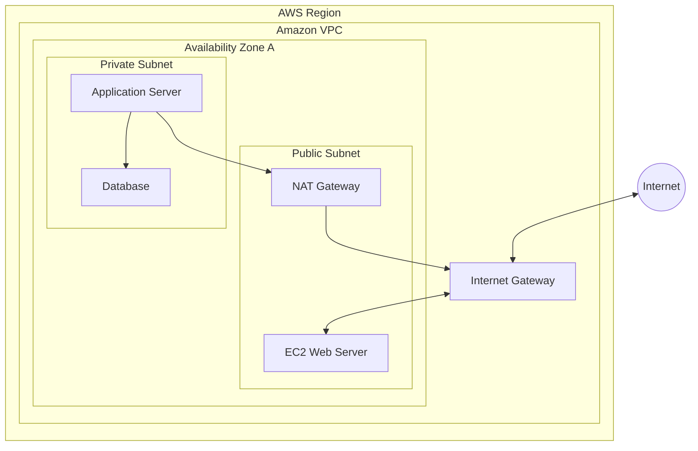
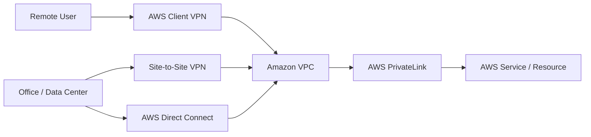
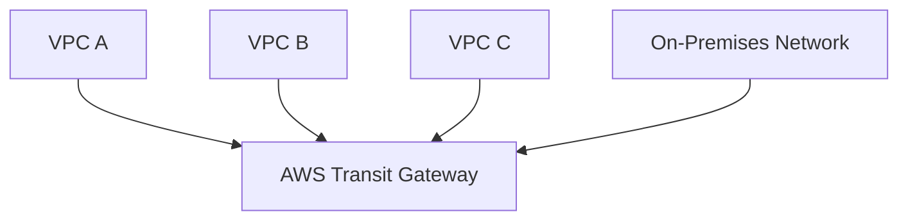
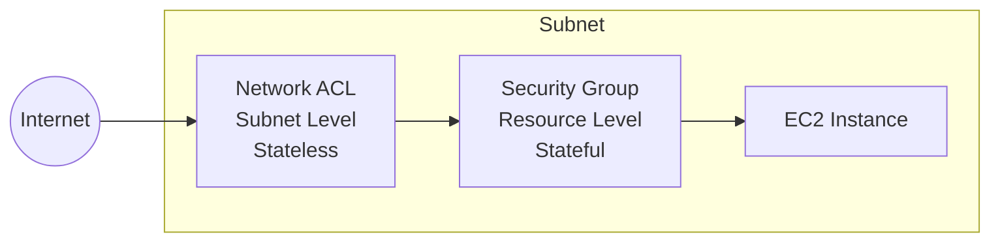
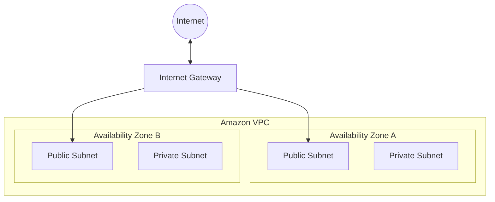
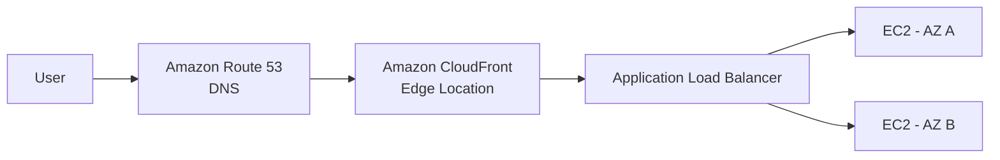
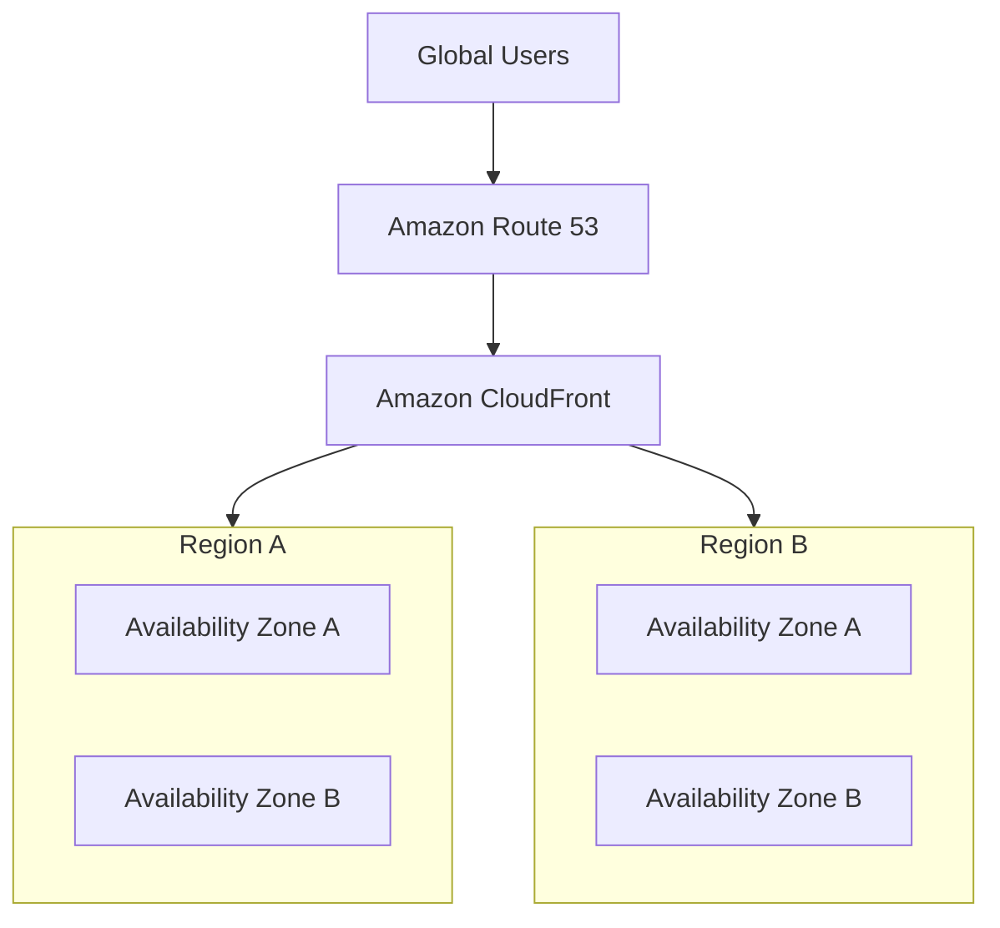

# AWS Cloud Practitioner Essentials

## Module 1 - Cloud Computing Fundamentals

### Key Concepts

- Cloud computing provides computing resources and services over the internet.
- AWS Global Infrastructure is organized into **Regions** and **Availability Zones**.
- A **Region** is a geographic area where AWS operates infrastructure.
- An **Availability Zone (AZ)** is an isolated physical location inside a Region.
- Using multiple Availability Zones improves **high availability** and **fault tolerance**.
- **Hybrid Cloud** combines infrastructure controlled by an organization with public cloud services such as AWS.

### Shared Responsibility Model

- **AWS:** Security **of** the cloud.
- **Customer:** Security **in** the cloud.

### Quick Review

**What is Hybrid Cloud?**  
Using private/on-premises infrastructure together with public cloud services.

**What benefit reduces physical infrastructure costs?**  
Stop spending money running and maintaining data centers.

**What does "Stop guessing capacity" mean?**  
Instead of predicting future hardware needs, cloud resources can scale according to demand.

**What are two benefits of AWS Global Infrastructure?**  
High availability and fault tolerance.

### Topics to Review

- Cloud computing basics
- Regions
- Availability Zones
- Hybrid Cloud
- Shared Responsibility Model

## Module 2 - Compute

### Amazon EC2

Amazon Elastic Compute Cloud (EC2) provides resizable virtual servers in AWS.

EC2 allows users to choose the amount of compute capacity needed and adjust resources according to workload requirements.

---

### EC2 Instance Types

EC2 instances are grouped into categories based on the type of workload they are optimized for.

#### General Purpose

Provide a balanced combination of:

- Compute
- Memory
- Networking

They are suitable for workloads that do not require specialization in one specific resource.

#### Compute Optimized

Designed for workloads that require high CPU performance.

They are appropriate when processing power is the primary requirement.

#### Memory Optimized

Designed for workloads that require large amounts of RAM.

They are useful when applications need to process or maintain large amounts of data in memory.

#### Storage Optimized

Designed for workloads that require high storage performance and high read/write throughput.

They are optimized for workloads where storage speed and I/O performance are important.

#### Accelerated Computing

Use specialized hardware accelerators such as GPUs.

They are designed for workloads that benefit from hardware acceleration rather than relying only on traditional CPU processing.

---

### EC2 Pricing Options

AWS provides different EC2 pricing models depending on workload characteristics, flexibility, and cost requirements.

#### On-Demand

Provides compute capacity without a long-term commitment.

Main characteristics:

- High flexibility
- Pay for usage
- No long-term commitment
- Suitable for unpredictable workloads

#### Reserved Instances

Provide discounted pricing in exchange for a longer-term commitment.

They are most useful when workloads are predictable and expected to run consistently for an extended period.

#### Savings Plans

Provide discounted compute pricing in exchange for committing to a consistent amount of compute usage for a period of time.

They are useful for predictable and steady-state workloads.

#### Spot Instances

Use unused AWS compute capacity at a significantly reduced price.

The main limitation is that AWS can interrupt Spot Instances when the capacity is needed elsewhere.

They are best suited for workloads that can tolerate interruptions.

---

### Steady-State Workloads

A steady-state workload has relatively consistent and predictable resource usage over time.

Because the required capacity is predictable, these workloads can benefit from long-term pricing options such as Savings Plans or Reserved Instances.

---

### EC2 Multi-Tenancy

AWS normally uses a multi-tenant infrastructure model.

Multiple customers may share the same underlying physical infrastructure while their workloads remain logically isolated from each other.

Isolation between customers is an important part of the AWS cloud architecture.

---

### Dedicated Hosts

Dedicated Hosts provide physical EC2 servers dedicated to a single customer.

They can be useful when organizations have specific requirements related to:

- Compliance
- Licensing
- Physical server isolation

They are different from the standard multi-tenant EC2 model.

---

### AWS Management Tools

AWS provides several ways to interact with services.

#### AWS Management Console

A web-based graphical user interface (GUI) used to manage AWS services.

#### AWS Command Line Interface (AWS CLI)

Allows users to manage AWS services through command-line commands.

#### AWS Software Development Kits (SDKs)

Allow applications and developers to interact with AWS services programmatically using supported programming languages.

---

### Amazon EC2 Auto Scaling

Amazon EC2 Auto Scaling automatically adjusts the number of EC2 instances according to application demand and configured metrics.

It can:

- Add instances when demand increases
- Remove instances when demand decreases
- Improve availability
- Improve performance
- Reduce unnecessary costs

Auto Scaling focuses on adjusting compute capacity.

---

### Elastic Load Balancing

Elastic Load Balancing (ELB) automatically distributes incoming application traffic across multiple resources.

Its main purposes are:

- Distribute traffic
- Improve availability
- Reduce overload on individual instances
- Support fault tolerance

---

### Auto Scaling and Elastic Load Balancing

Amazon EC2 Auto Scaling and Elastic Load Balancing complement each other.

- **Auto Scaling** controls the number of EC2 instances.
- **Elastic Load Balancing** distributes traffic across those instances.

Together, they help applications remain scalable and highly available.

---

### Loosely Coupled Architecture

A loosely coupled architecture reduces dependencies between system components.

Each component can operate more independently, which reduces the impact of failures.

Benefits include:

- Greater resilience
- Better fault tolerance
- Easier scalability
- Reduced dependency between components

If one component fails, other components may continue operating.

---

### Amazon Simple Notification Service (SNS)

Amazon SNS is a publish/subscribe messaging service.

It distributes messages from a publisher to one or more subscribers.

SNS is primarily used for:

- Notifications
- Message distribution
- Event-based communication

Its purpose is to deliver messages to interested subscribers when an event occurs.

---

### Amazon Simple Queue Service (SQS)

Amazon SQS is a message queuing service.

It stores messages until they are retrieved and processed by another application or service.

SQS helps decouple application components because producers and consumers do not need to communicate directly or operate at the same time.

Its main benefits include:

- Reliable message storage
- Decoupling components
- Improved resilience
- Asynchronous processing

---

### SNS vs SQS

Although both services are used for messaging, they serve different purposes.

#### SNS

- Publish/subscribe model
- Distributes messages
- Sends messages to multiple subscribers
- Focuses on notification and event delivery

#### SQS

- Message queue model
- Stores messages
- Messages remain available until processed
- Focuses on reliable asynchronous processing

SNS and SQS can also be used together in architectures that require both message distribution and message queuing.

---

### Key Takeaways

- Amazon EC2 provides scalable virtual compute capacity.
- EC2 instance types are optimized for different resource requirements.
- Compute Optimized focuses on CPU performance.
- Memory Optimized focuses on RAM.
- Storage Optimized focuses on storage performance and I/O.
- Accelerated Computing uses specialized hardware such as GPUs.
- On-Demand provides flexibility without long-term commitments.
- Reserved Instances and Savings Plans are suited for predictable workloads.
- Spot Instances offer lower costs but can be interrupted.
- AWS normally uses a multi-tenant infrastructure model.
- Dedicated Hosts provide physical servers dedicated to one customer.
- The AWS Management Console provides a graphical interface.
- AWS CLI provides command-line access.
- AWS SDKs provide programmatic access.
- EC2 Auto Scaling adjusts the number of instances according to demand.
- Elastic Load Balancing distributes traffic across resources.
- Loosely coupled architectures reduce dependencies between components.
- SNS distributes messages and notifications.
- SQS stores messages until they are processed.

# Module 4 - AWS Global Infrastructure

## Overview

This module focused on how AWS Global Infrastructure is organized and how businesses can use it to improve:

- High availability
- Fault tolerance
- Agility
- Elasticity
- Global performance

The main topics were:

- AWS Regions
- Availability Zones
- Edge locations
- Choosing a Region
- Infrastructure as Code
- AWS CloudFormation
- Ways to interact with AWS resources

---

## Choosing an AWS Region

Choosing the correct AWS Region depends on several factors.

### Compliance

Different countries and regions have different laws and regulations.

Organizations may need to choose specific AWS Regions to comply with requirements such as:

- Data protection laws
- Data residency requirements
- Industry regulations

Example:

The GDPR applies to personal data belonging to individuals in the European Union.

---

### Proximity

Regions closer to users can reduce latency.

Lower latency means:

- Faster response times
- Better application performance
- Better user experience

Choosing a Region far away from users can increase delay.

---

### Feature Availability

Not every AWS service or feature is available in every Region.

Before selecting a Region, it is important to verify whether the required AWS services are supported there.

Example:

AWS GovCloud Regions are designed for specific US government security and compliance requirements.

---

### Pricing

AWS pricing can vary between Regions.

Factors that may affect cost include:

- Regional operating costs
- Taxes
- Regulations
- Data sovereignty requirements

---

# AWS Global Infrastructure

## Regions

AWS Regions are geographical areas around the world.

Each Region:

- Contains multiple Availability Zones
- Provides redundant infrastructure
- Is separated from other Regions

AWS Regions help businesses deploy applications closer to users and improve resilience.

---

## Availability Zones

Availability Zones (AZs) are isolated locations inside an AWS Region.

Each AZ has its own:

- Power
- Networking
- Connectivity

Each Availability Zone consists of one or more data centers.

AWS Regions contain multiple Availability Zones.

Using multiple AZs can improve:

- High availability
- Fault tolerance
- Application reliability

---

## Multi-Region and Multi-AZ Architectures

AWS resources can be distributed across:

- Multiple Availability Zones
- Multiple Regions
- Or both

This creates redundancy.

If one location becomes unavailable, another location can continue serving users.

---

# High Availability, Agility and Elasticity

## High Availability

High availability means a system can continue operating even when individual components fail.

Example:

Deploying an application across multiple Availability Zones can reduce downtime if one AZ fails.

---

## Agility

Agility is the ability to quickly adapt to changing requirements.

AWS makes it possible to:

- Deploy resources quickly
- Modify infrastructure
- Introduce new services faster

---

## Elasticity

Elasticity is the ability to scale resources up or down based on demand.

Example:

```text
More users
    ↓
More AWS resources

Less demand
    ↓
Reduce resources
```

This allows infrastructure to adapt to workload changes.

---

# Edge Locations

AWS also operates edge locations around the world.

Edge locations are smaller AWS facilities designed to bring content and services closer to users.

They can cache content such as:

- Images
- Videos
- Web content
- Application resources

The goal is to reduce latency and improve transfer speed.

---

## Amazon CloudFront

Amazon CloudFront is an AWS Content Delivery Network (CDN).

CloudFront uses edge locations to deliver cached content closer to users.

Conceptually:

```text
Origin Server
     ↓
Edge Location
     ↓
User
```

Instead of retrieving content from a distant Region every time, users can receive cached content from a nearby edge location.

---

# Region vs Availability Zone vs Edge Location

## Region

A geographical area containing multiple Availability Zones.

## Availability Zone

An isolated location inside a Region containing one or more data centers.

## Edge Location

A location closer to end users used for services such as content delivery and caching.

Quick comparison:

```text
Region
 ├── Availability Zone
 ├── Availability Zone
 └── Availability Zone

Edge Locations
 └── Distributed closer to users globally
```

---

# Infrastructure as Code (IaC)

Infrastructure as Code means defining and managing infrastructure using code or configuration files instead of manually creating resources.

Benefits include:

- Automation
- Consistency
- Repeatability
- Faster deployment
- Easier scaling

---

# AWS CloudFormation

AWS CloudFormation is an Infrastructure as Code service.

CloudFormation allows infrastructure to be defined using templates.

A template describes the AWS resources that should be created.

Example resources include:

- EC2 instances
- Networking resources
- Storage resources
- Other AWS services

CloudFormation then provisions and configures those resources automatically.

Conceptually:

```text
CloudFormation Template
        ↓
AWS CloudFormation
        ↓
AWS Resources
```

This helps create infrastructure in a consistent and repeatable way.

---

# Ways to Interact with AWS

AWS resources are ultimately managed through AWS APIs.

AWS provides several ways to interact with these APIs.

---

## AWS Management Console

The AWS Management Console is a graphical web interface.

It is useful for:

- Beginners
- Manual configuration
- Billing dashboards
- Cost visualization
- Services with graphical interfaces

---

## AWS CLI

The AWS Command Line Interface allows AWS services to be managed from the terminal.

It can be useful for:

- Automation
- Scripts
- Repetitive tasks

Example use case:

Automating backups.

---

## AWS SDKs

AWS SDKs allow applications to interact with AWS services using programming languages.

They can be used to call AWS APIs directly from applications.

Example:

An application could use an AWS SDK to store user data in Amazon S3.

---

## Infrastructure as Code

Tools such as CloudFormation automate infrastructure creation and management.

Useful for:

- DevOps
- CI/CD pipelines
- Repeatable deployments
- Multi-Region environments
- Scaling infrastructure consistently

---

# Quick Comparison

| Method | Best Use |
|---|---|
| AWS Management Console | Manual management and beginners |
| AWS CLI | Command-line automation and scripting |
| AWS SDK | Integrating AWS services into applications |
| CloudFormation | Automated and repeatable infrastructure deployment |

---

# Important Concepts to Remember

### Choosing a Region

Consider:

```text
Compliance
Proximity
Feature availability
Pricing
```

### AWS Global Infrastructure

```text
Region
   ↓
Availability Zones
   ↓
Data Centers
```

Edge locations exist separately to bring services and content closer to users.

### Infrastructure Benefits

```text
High Availability
Agility
Elasticity
Fault Tolerance
```

### Infrastructure as Code

```text
Infrastructure defined as code
        ↓
Automated deployment
        ↓
Consistent environments
```

---

# Module 4 Summary

In this module, I learned:

- How AWS Regions are selected
- The difference between Regions, Availability Zones, and edge locations
- How multiple Regions and AZs improve availability and fault tolerance
- The difference between high availability, agility, and elasticity
- How edge locations reduce latency
- How CloudFront uses edge locations for content delivery
- What Infrastructure as Code means
- How AWS CloudFormation automates infrastructure deployment
- The difference between the AWS Console, CLI, SDKs, and CloudFormationgit status

# Module 5 - Networking

## Overview

This module focused on networking in AWS and how resources communicate securely inside and outside the AWS Cloud.

Main concepts:

- Amazon VPC
- Public and private subnets
- Internet gateways
- Virtual private gateways
- VPN connections
- AWS PrivateLink
- AWS Direct Connect
- Transit Gateway
- NAT Gateway
- API Gateway
- Network ACLs
- Security Groups
- Route tables
- DNS and Route 53
- CloudFront
- Global Accelerator

---

# Amazon VPC

Amazon Virtual Private Cloud (VPC) provides a logically isolated virtual network inside AWS.

A VPC gives control over:

- Resource placement
- Connectivity
- Network security
- Traffic flow

Conceptually:

```text
AWS Cloud
   ↓
Region
   ↓
VPC
   ↓
Subnets
   ↓
AWS Resources
```

A VPC acts as a network boundary around AWS resources.

---

# Subnets

A subnet is a range of IP addresses inside a VPC.

Subnets help organize resources based on security and operational requirements.

There are two important types:

## Public Subnet

Designed for resources that need internet accessibility.

Examples:

- Public web servers
- Customer-facing applications

A public subnet can use an Internet Gateway to communicate with the internet.

## Private Subnet

Designed for resources that should not be directly exposed to the internet.

Examples:

- Databases
- Internal application servers
- Sensitive backend systems

A common architecture is:

```text
Internet
   ↓
Public Subnet
   ↓
Application
   ↓
Private Subnet
   ↓
Database
```

---

## VPC Architecture Overview



Mental model:

```text
AWS Region
└── VPC
    ├── Public Subnet
    │   ├── EC2 Web Server
    │   └── NAT Gateway
    │
    └── Private Subnet
        ├── Application Server
        └── Database
```

Important:

```text
Public subnet
→ resources that may need direct internet connectivity

Private subnet
→ resources that should not be directly exposed

Internet Gateway
→ connects the VPC to the internet

NAT Gateway
→ lets private resources initiate outbound internet connections
```

---

# Internet Gateway

An Internet Gateway connects a VPC to the public internet.

```text
Internet
   ↕
Internet Gateway
   ↕
VPC
```

Without an Internet Gateway and appropriate routing, resources cannot directly communicate with the public internet.

---

# Virtual Private Gateway

A Virtual Private Gateway allows protected VPN traffic to enter a VPC.

It can connect:

```text
On-Premises Network
        ↓
Encrypted VPN
        ↓
Virtual Private Gateway
        ↓
VPC
```

The VPN protects traffic traveling across the public internet.

---

# VPN

A Virtual Private Network (VPN) creates an encrypted tunnel over the internet.

Its purpose is to protect data from interception while it travels between networks.

---

# AWS Client VPN

AWS Client VPN provides secure remote access to AWS and on-premises resources.

Typical use case:

```text
Remote Employee
      ↓
Client VPN
      ↓
AWS Resources
```

Key characteristics:

- Fully managed
- Elastic
- Secure remote access
- Automatically scales with user demand

---

# AWS Site-to-Site VPN

Site-to-Site VPN securely connects an entire network to AWS.

Example:

```text
Company Data Center
        ↓
Encrypted VPN
        ↓
AWS VPC
```

Common uses:

- Connecting branch offices
- Hybrid cloud
- Connecting data centers to AWS

---

# AWS PrivateLink

AWS PrivateLink allows private connectivity between a VPC and supported services or resources.

It avoids the need to send traffic through:

- Public internet
- Internet Gateway
- NAT
- Public IP addresses
- Site-to-Site VPN

Conceptually:

```text
Private VPC
    ↓
PrivateLink
    ↓
Service / Resource
```

The connection remains private.

---

# AWS Direct Connect

AWS Direct Connect provides a dedicated private connection between an organization and AWS.

Unlike a VPN, Direct Connect does not primarily depend on the public internet.

```text
Company Network
      ↓
Dedicated Connection
      ↓
AWS
```

Useful for:

- High bandwidth
- Large data transfers
- Consistent network performance
- Latency-sensitive workloads
- Hybrid cloud environments

Multiple Direct Connect connections can also provide redundancy and additional bandwidth.

---

## AWS Connectivity Overview



Quick mental model:

```text
Remote User
   ↓
Client VPN
   ↓
AWS

Office / Data Center
   ↓
Site-to-Site VPN
   ↓
AWS

Office / Data Center
   ↓
Direct Connect
   ↓
Dedicated private connection
   ↓
AWS

VPC
   ↓
PrivateLink
   ↓
Private AWS service/resource
```

---

# Additional Gateway Services

## AWS Transit Gateway

Transit Gateway acts as a central networking hub.

It can connect:

- Multiple VPCs
- On-premises networks
- Different network environments



Mental model:

```text
        VPC A
          │
VPC B ── TGW ── VPC C
          │
      On-Premises
```

---

## NAT Gateway

A NAT Gateway allows resources in a private subnet to initiate connections outside the VPC.

External systems cannot directly initiate connections back to those private instances.

Example:

```text
Private EC2
    ↓
NAT Gateway
    ↓
Internet
```

Important:

```text
Private instance → Internet
YES

Internet → Private instance directly
NO
```

---

## Amazon API Gateway

API Gateway is used to:

- Create APIs
- Publish APIs
- Maintain APIs
- Monitor APIs
- Secure APIs

It handles communication between clients and backend applications or services.

---

# Network Traffic in a VPC

Network traffic is transferred using packets.

A packet entering a VPC can pass through several security controls before reaching a resource.

A simplified flow can look like:

```text
Internet
   ↓
Internet Gateway
   ↓
Network ACL
   ↓
Subnet
   ↓
Security Group
   ↓
EC2 Instance
```

This introduces two important AWS network security controls:

```text
Network ACL
Security Group
```

---

# Network ACLs

A Network Access Control List (NACL) controls traffic at the:

```text
Subnet level
```

It controls:

- Inbound traffic
- Outbound traffic

Network ACLs support:

```text
ALLOW rules
DENY rules
```

## Stateless Filtering

Network ACLs are stateless.

This means they do not remember previous traffic.

If traffic leaves:

```text
Request
   →
```

the returning traffic:

```text
Response
   ←
```

must also be independently evaluated against the NACL rules.

Conceptually:

```text
Inbound packet
→ check rules

Outbound packet
→ check rules again
```

---

# Security Groups

Security Groups control traffic at the:

```text
Resource / instance level
```

For example:

```text
EC2 Instance
```

By default:

```text
Inbound
→ denied unless explicitly allowed

Outbound
→ allowed
```

Security Groups primarily use allow rules.

---

## Stateful Filtering

Security Groups are stateful.

This means they remember connections.

If an EC2 instance sends an allowed request:

```text
EC2 → Internet
```

the response can return:

```text
Internet → EC2
```

without requiring a separate inbound Security Group rule specifically for that response.

---

# Security Group vs Network ACL

| Security Group | Network ACL |
|---|---|
| Resource level | Subnet level |
| Stateful | Stateless |
| Controls inbound/outbound | Controls inbound/outbound |
| Primarily Allow rules | Allow and Deny rules |
| Remembers connections | Checks both directions independently |

Easy way to remember:

```text
Security Group
→ guards the RESOURCE

Network ACL
→ guards the SUBNET
```

---

## NACL and Security Group Placement



Mental model:

```text
                 SUBNET
┌────────────────────────────────────┐
│                                    │
│       Network ACL boundary         │
│                                    │
│            ┌───────────┐           │
│            │ Security  │           │
│            │   Group   │           │
│            │           │           │
│            │    EC2    │           │
│            └───────────┘           │
│                                    │
└────────────────────────────────────┘
```

Remember:

```text
NACL
→ protects the subnet boundary
→ stateless

Security Group
→ protects the resource
→ stateful
```

---

# Shared Responsibility

AWS provides the networking infrastructure.

The customer is responsible for correctly configuring controls such as:

- Security Groups
- Network ACLs
- Subnets
- Network access rules

This belongs to:

```text
Security IN the cloud
```

---

# Route Tables

Route tables determine where network traffic should be sent.

They contain routes that define:

```text
Destination
→ Where the traffic should go
```

For a public subnet, a route can direct internet traffic toward an Internet Gateway.

Conceptually:

```text
Public Subnet
     ↓
Route Table
     ↓
Internet Gateway
     ↓
Internet
```

---

# Building a Basic VPC

A basic AWS network could be created in this order:

```text
1. Choose Region
2. Create VPC
3. Create public/private subnets
4. Place subnets across multiple AZs
5. Create Internet Gateway
6. Attach Internet Gateway to VPC
7. Create route tables
8. Configure routes
9. Associate subnets
10. Configure Security Groups / NACLs
11. Deploy resources
```

Using multiple Availability Zones improves high availability.

A simplified multi-AZ architecture:



This provides redundancy across separate Availability Zones.

---

# DNS

DNS means:

```text
Domain Name System
```

DNS translates human-readable domain names into IP addresses.

Example:

```text
example.com
     ↓
DNS
     ↓
192.0.2.10
```

DNS resolution allows users to access applications using names instead of remembering IP addresses.

---

# Amazon Route 53

Amazon Route 53 is AWS's scalable DNS service.

It can:

- Route users to applications
- Manage DNS records
- Register domain names
- Perform health checks
- Use routing policies
- Route to AWS or external infrastructure

Conceptually:

```text
User
 ↓
Domain Name
 ↓
Route 53
 ↓
IP / AWS Resource
```

---

# Amazon CloudFront

Amazon CloudFront is a Content Delivery Network (CDN).

It uses AWS edge locations to cache and deliver content closer to users.

Benefits include:

- Lower latency
- Faster loading
- High transfer speeds
- Global content delivery

Conceptually:

```text
Origin Server
     ↓
CloudFront
     ↓
Edge Location
     ↓
User
```

Instead of every request reaching a distant origin server, cached content can be delivered from a nearby edge location.

---

# Route 53 + CloudFront

Route 53 and CloudFront can work together to deliver global applications.



Conceptually:

```text
User
 ↓
Route 53
DNS / routing
 ↓
CloudFront
Edge location / cached content
 ↓
Load Balancer
 ↓
Application Resources
```

This combines:

```text
DNS
+
Edge networking
+
Load balancing
+
Multiple Availability Zones
```

to improve performance and availability.

---

# AWS Global Accelerator

AWS Global Accelerator uses the AWS global network to improve:

- Application performance
- Availability
- Reliability
- Security

Instead of relying only on normal public internet routing, traffic can enter the AWS global network and be routed more efficiently.

Useful for applications requiring:

- Low latency
- Fast failover
- Reliable global access

Examples include:

- Gaming
- Financial applications
- Global services

---

# CloudFront vs Global Accelerator

A useful high-level distinction:

```text
CloudFront
→ CDN
→ caches and delivers content closer to users

Global Accelerator
→ network routing optimization
→ improves global connectivity and failover
```

---

# Global AWS Architecture

A global application could use:



This type of architecture can improve:

- Availability
- Fault tolerance
- Global performance
- Low latency

---

# Important Concepts to Remember

## Basic AWS Network

```text
AWS Cloud
   ↓
Region
   ↓
VPC
   ↓
Subnet
   ↓
Resources
```

---

## Public Internet Access

```text
EC2 in Public Subnet
        ↓
Route Table
        ↓
Internet Gateway
        ↓
Internet
```

---

## Private Internet Access

```text
EC2 in Private Subnet
        ↓
NAT Gateway
        ↓
Internet Gateway
        ↓
Internet
```

The internet cannot directly initiate a connection back to the private instance.

---

## Hybrid Connection

```text
On-Premises Network
       ↓
VPN
or
Direct Connect
       ↓
AWS VPC
```

---

## Network Security

```text
Network ACL
→ Subnet level
→ Stateless

Security Group
→ Resource level
→ Stateful
```

---

## Global Networking

```text
Route 53
→ DNS

CloudFront
→ CDN / caching

Global Accelerator
→ global network routing / performance
```

---

## Connectivity

```text
Client VPN
→ Individual remote users

Site-to-Site VPN
→ Network-to-network encrypted connection

Direct Connect
→ Dedicated private connection

PrivateLink
→ Private access to services/resources
```

---

# Module 5 Summary

In this module, I learned:

- What a VPC is and why AWS uses isolated virtual networks
- The difference between public and private subnets
- How Internet Gateways connect VPCs to the internet
- How VPNs and Virtual Private Gateways protect network connections
- The differences between Client VPN and Site-to-Site VPN
- What AWS PrivateLink does
- When Direct Connect is useful
- How Transit Gateway connects multiple networks through a central hub
- How NAT Gateway provides outbound internet access for private resources
- What API Gateway is used for
- The difference between Network ACLs and Security Groups
- The difference between stateless and stateful filtering
- How route tables direct network traffic
- How multi-AZ architectures improve availability
- How DNS works
- What Route 53 provides
- How CloudFront uses edge locations
- How Global Accelerator improves global network performance